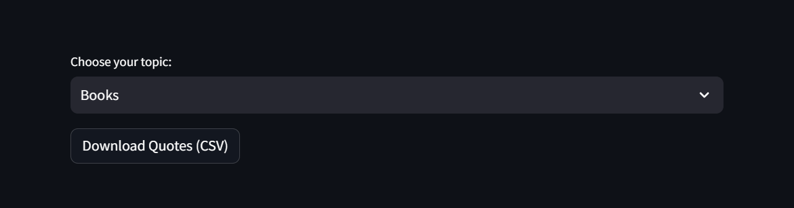
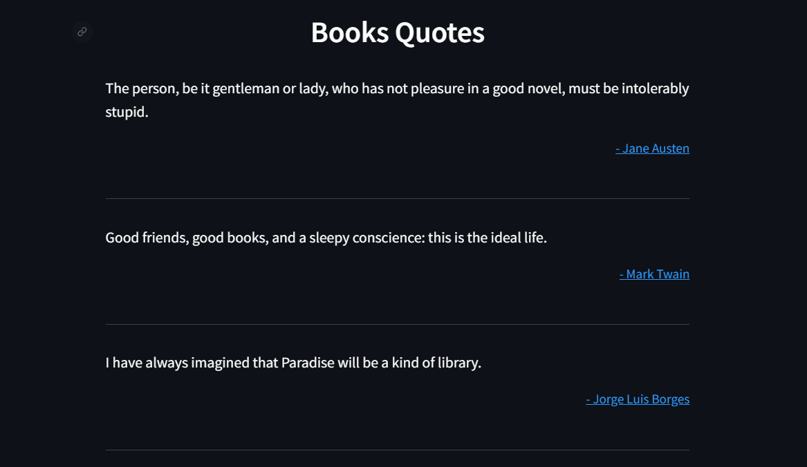
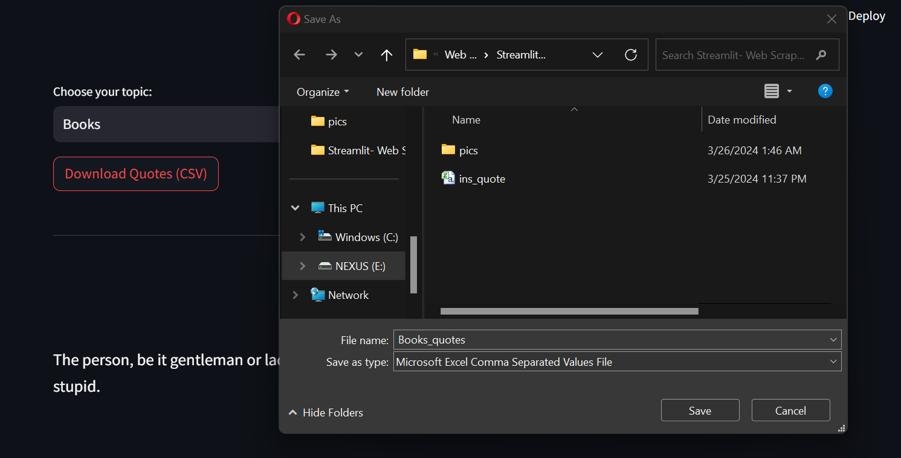
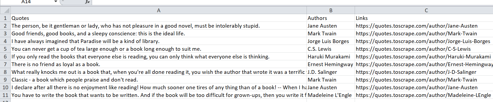

# Soupy Quotes: A Streamlit Web Scraping App

This project is a web scraping application built using BeautifulSoup and Streamlit. It scrapes quotes from [quotes.toscrape.com](https://quotes.toscrape.com) based on user-selected topics and allows users to download the results as a CSV file using Pandas.


## Features

- User-friendly interface built with Streamlit.
- Cleans the text data retrieved from the website.
- Allows users to download the scraped quotes as a CSV file.
- Displays the scraped quotes along with their authors and links to the original source.


## Technologies Used
**Streamlit**: A Python library for creating interactive web applications.

**Beautiful Soup**: A Python library for parsing HTML and XML documents.

**Pandas**: A Python library for data analysis and manipulation.

**Requests**: A Python library for making HTTP requests.

**Base64**: A Python library for encoding and decoding binary data (used for CSV download).

**Regular Expressions (re)**: A Python library for pattern matching in text (used for cleaning text).


## Installation

1. Clone this repository.

```bash
 git clone https://github.com/Rushi2810/Soupy-Quotes-A-Streamlit-Web-Scraping-App.git

```
2. Navigate to the project directory.
```bash
cd main.py

```
3. Install the required dependencies.
```bash
pip install streamlit beautifulsoup4 pandas requests base64
```
## Usage

1. Run the Streamlit app.
```bash
streamlit run main.py

```
2. Select your desired topic from the dropdown menu.
3. View the scraped quotes displayed on the web interface.
4. Click on the "Download Quotes (CSV)" button to download the quotes as a CSV file. 

## Screenshots

1. The screenshot shows a dropdown menu labeled "Choose your topic" with available options like "Humor," "Love," "Life," "Books," and "Inspirational." This allows users to select a category for scraping quotes 


2. This screenshot showcases the results page of the app after a topic is chosen.


3.  This screenshot captures the functionality for exporting scraped quotes.


4. The CSV file contains three columns: "Quotes," "Authors," and "Links". This structure allows users to easily access and analyze the collected data.

## Dependencies

 - [Streamlit](https://streamlit.io)
 - [Pandas](https://pandas.pydata.org/docs/)
 - [Beautiful Soup](https://www.crummy.com/software/BeautifulSoup/bs4/doc/)


## Note

Contributions and feedback are always welcome!


